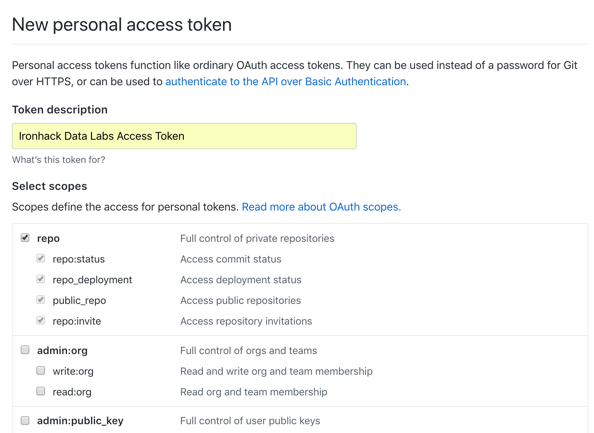

# Lab | API Scavenger Game

## Introduction

In the lesson, you have learned how to make Python requests to APIs and parse the JSON responses to extract the information you need. In this lab, you will practice these skills by playing an API scavenger hunt game. In case you haven't played scavenger hunt when you were a kid, in a scavenger hunt players need to collect a list of items and they receive clues to help them in the mission. In this lab, you will be seeking secrets hidden inside the massive data from the API. Your data analytics skills will make you a cool API detective. 

## Getting Started

In order to get started, we'd like you to create an access token in your [Github account](https://github.com/settings/tokens). 

1. Click `Generate new token` in the page.
1. Enter token description.
1. Select the scopes for which you allow the token to access. Check at least all the `repo` checkboxes as shown in the screenshot below.
1. Click `Generate token`. Github will create a personal access token for you. 



A personal access token is a secret password to allow you or your app to make remote requests to the Github API. It is the same technology as the Twitter developer access token discussed in the lesson but in Github you don't need to wait for the approval and your token will be available immediately. Make sure you save the token on your computer because this is the only time you can save it.

:warning: **Do not share your Github personal access token with anyone else!**

:bulb: If for any reason you lost your token, simply come back to Github and re-authorize yourself a new token.

After generating the token, you can test it with `curl` in the Terminal. Assuming your Git username is `johndoe` and token is `d10ev1shpm10x5qox9ckw1k9b792p9rq0ogplpn5cyo55`, you can make the curl command in the following way:

```bash
$ curl -u johndoe:d10ev1shpm10x5qox9ckw1k9b792p9rq0ogplpn5cyo55 https://api.github.com/user`

```

If your token is valid, you will see a JSON response that looks like:

```
{
  "login": "johndoe",
  "id": 1234567,
  "node_id": "MDQ6VXNlcjE2NTk3OTg=",
  "avatar_url": "https://avatars3.githubusercontent.com/u/1659798?v=4",
  "gravatar_id": "",
  "url": "https://api.github.com/users/johndoe",
  "html_url": "https://github.com/johndoe",
  "followers_url": "https://api.github.com/users/johndoe/followers",
  ...
}
```

:information_source: Access token is one of the ways to authenticate requests to Github API. Alternatively, you can also use your Github username and password. However, you'll need to manually enter your password every time when you make API requests. In contrast, access token allows you to make requests without entering password manually. For more information about Github API authentications, refer to [this](https://developer.github.com/v3/auth/) and [this](https://developer.github.com/v3/auth/) documentation. 

## Goals

1. Use Github API to find out the 50 secret files whose filenames contain `.scavengerhunt`. 


## Deliverables


## Submission

Upon completion, add your deliverables to git. Then commit git and push your code to the remote.

## Resources


## Additional Challenge for the Nerds

